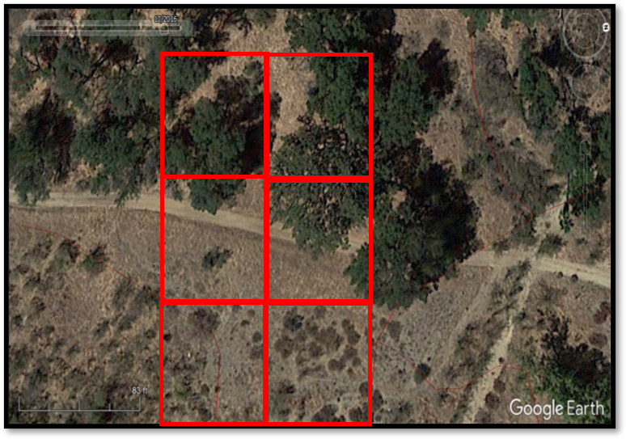
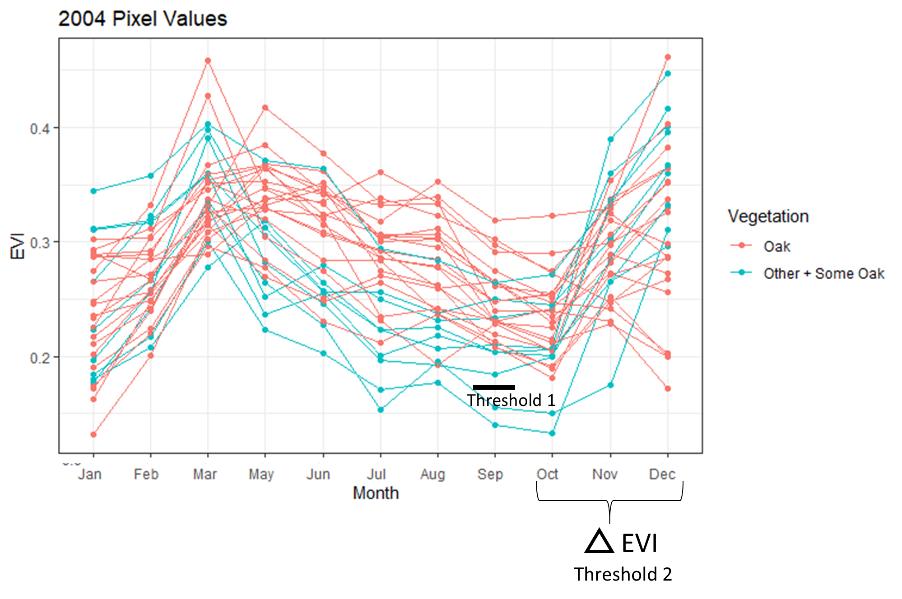
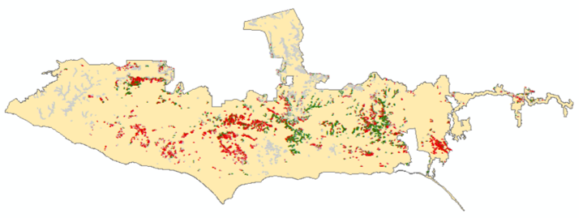
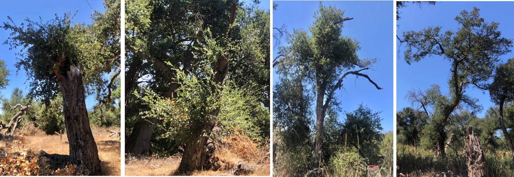

# Background 

During a summer internship (2020) with the Future Park Leaders of Emerging Change (FPL), currently known as Scientists in Parks, I worked with the NPS at Santa Monica Mountains National Recreation Area (SAMO) to understand the extent of oak dieback caused during the 2011-2018 California mega drought. This was the most severe drought in 1,200 years (1) and resulted in the loss of over 129 million trees across the state (2). The goals of the internship were:

1) Determine the best method to identity drought induced oak dieback
2) Determine where dieback has likly occured across the park

 

# Results

I assessed several different remote sensing approaches and determined that using the enhanced vegetation index (EVI) with 30m Landsat imagery was the best method to monitor drought dieback. Landsat was the highest resolution imagery that was free and available both before and throughout the drought. However, I hypothesize higher resolution imagery will be better for this analysis since there will be less heterogeneity within pixels. EVI is an index that essentially quantifies vegetation greenness. EVI is easy to calculate and robust compared to similar indices. There are much more advanced techniques to monitor drought, but EVI is the simplest approach and would be easily reproducible in the future by NPS staff at SAMO with little to no remote sensing or coding experience. However, a drawback of EVI is all vegetation is green. Meaning there can be overlap with other vegetation that grows in or around oaks (Figure 1). While oak stands have been mapped within the park, their boundaries contain other vegetation. Thus, using EVI results in a lot of overlap with pixels dominated by other vegetation types. To overcome this issue I had to take an extra step to ensure the pixels being analyzed were actually oaks.

**Figure 1:** Annual grasses and coastal sage scrub grows within the boundary of a mapped oak woodland polygon. The red boxes indicate the boundary of a 30m landsat pixel and demonstrate the overlap of other vegetation growing in the understory of the oaks which can influence the EVI values. 

 

A two-step threshold was used to remove non-oak dominated pixels (Figure 2), which were pixels with less than 50% oaks. The first step removed pixels with EVI < 0.18, which resulted in high oak classification accuracy, but also high misclassification of other vegetation as oaks. The seocond step took advantage of the rapid increase in EVI between October and December, which is likely due to annuals like annual grass quickly taking advantage of rainfall. Pixels with EVI > 0.115 were also removed. The two step approach resulted in a slightly lower oak classification accuracy from 89% to 85%, but greatly reduced the misclassification of other vegetation as oaks from 52% to just 39%. Oak pixels burned in a fire between 2005-2016 were also removed to avoid confusion between drought and fire induced canopy dieback.

**Figure 2:** Visual representation of the two thresholds. Oaks, in pink, are oak dominated pixels (>50% of the pixel is covered with oaks).Other + Some Oak, in blue, are pixels dominated by other vegetation but contain some oaks (<50%). 

  

I used a Z score ((EVI year - EVI baseline)/standard deviation baseline) to assess the effect of drought on oaks (Figure 3). This method compares average summer (August, September, October) EVI during the drought to a pre-drought baseline (2000-2004). Most oaks with dieback experienced notable decrease in EVI 3 years into the drought after 2014. But oaks with no dieback did not have noticeable loss in EVI until 7 years into the drought in 2018 and they had a much larger increase in EVI after the drought in 2019.

**Figure 3:** Trends of EVI Z scores for pixels classified as having high or no dieback. The dashed line at 0 is the baseline value. Values above 0 represent an increase in EVI compared to baseline, and values less than 0 represent a decrease in EVI compared to baseline. 

 

A binomial logistic regression using 2016 Z scores was used to determine a threshold for classifying dieback. Between 2,053-3,466 acres (45.6-77%) of oaks have a 95-55% probability, respectively, of experiencing high canopy dieback (Figure 4). However, this is likely an overestimate as visual comparisons in Google Earth did not verify these results. While many oak stands had some level of canoy dieback, not most did not have high dieback, which was defined as > 80% canopy loss. Future work should aim to adjust the model in order to quantify varying degrees of canopy dieback. 

**Figure 4:** Oaks with a 95% probability of dieback. Red = pixels with high dieback, green = pixels with no dieback, and grey = removed pixels. Note, the maps at this scale may be a little misleading since there are many pixels being plotted, so some may be hidden. 

 

One enlightening aspects of the projects were the results of qualitiative field surveys. COVID-19 did not allow for extensive field work, but a quick assessement showed that approxmately 80% of oaks that suffered high canopy dieback during the drought exhibited canopy regrowth (Figure 5). Even oaks that burned severely during the drought were showing signs of recovery. This just goes to show how fire and drought tolerant oaks really are!

**Figure 5:** Oaks that experienced high dieback recovering in summer 2020. 

 

To learn more about the project, download the final report [here](FINAL_REPORT_2020.pdf).

 

# Citations

1. Griffin, Daniel, Anchukaitis, Kevin J. 2014. How Unusual is the 2012-2014 California drought? Geophysical Research Letters. 41: 9017-9023.
2. Cal Fire. https://www.arcgis.com/apps/MapJournal/index.html?appid=3457736fb0dd45f98d41ab4030ebf048. Date accessed: Dec 2, 2020. 

